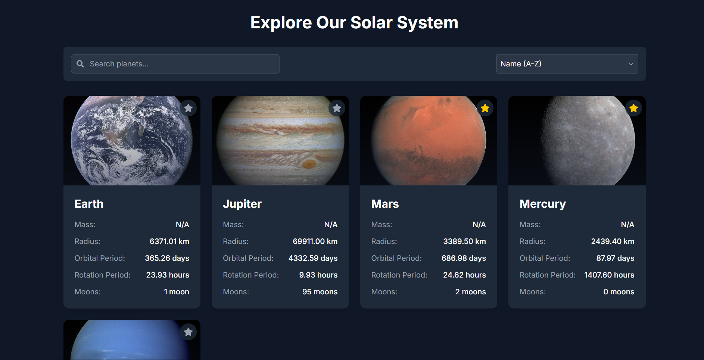
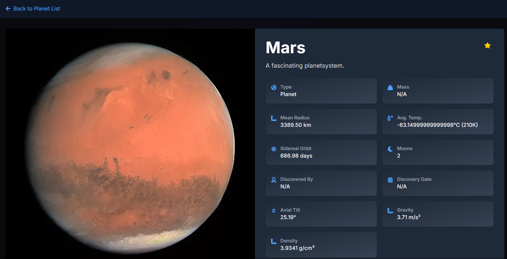

# Solar System Explorer

Una aplicación web interactiva que te permite explorar los planetas de nuestro sistema solar. 
Desarrollada con Next.js 15, TypeScript y Tailwind CSS.




**URL de la app desplegada**
[Solar System Explorer](https://reto-tres-astronautas-ami18au1y-codigonaturals-projects.vercel.app/)

## Características

- Exploración detallada de planetas del sistema solar
- Búsqueda y filtrado de planetas por nombre
- Diseño responsivo para todos los dispositivos
- Sistema de favoritos con almacenamiento local
- Paginación y ordenamiento
- Rutas dinámicas y manejo de estado eficiente

## Tecnologías Utilizadas

- **Next.js 15**: Framework React con renderizado del lado del servidor
- **TypeScript**: Tipado estático para mayor robustez
- **Tailwind CSS**: Framework de utilidades CSS
- **Zustand**: Manejo de estado global
- **React Icons**: Iconografía consistente
- **Framer Motion**: Animaciones suaves

## Instalación

1. Clona el repositorio:
```bash
git clone https://github.com/codigo-natural/reto-tres-astronautas.git
```

2. Instala las dependencias:
```bash
cd solar-system-app
npm install
```

3. Inicia el servidor de desarrollo:
```bash
npm run dev
```

4. Abre [http://localhost:3000](http://localhost:3000) en tu navegador.

## Decisiones Técnicas

### 1. Arquitectura y Estructura
- **App Router de Next.js**: Utilizado para aprovechar las últimas características de Next.js 15
- **Server Components**: Implementados para mejorar el rendimiento y SEO
- **Client Components**: Usados donde se requiere interactividad del usuario

### 2. Manejo de Estado
- **Zustand**: Implementado para el manejo de favoritos con persistencia local
- **URL State**: Parámetros de búsqueda y ordenamiento en la URL

### 3. Estilos
- **Tailwind CSS**: Para un desarrollo rápido y consistente
- **Diseño Responsivo**: Implementado con un enfoque mobile-first

### 4. Optimizaciones
- **Imágenes Optimizadas**: Uso de next/image para carga eficiente

## Características de UI/UX

- **Diseño Moderno**: Interfaz limpia y atractiva
- **Animaciones Suaves**: Transiciones y efectos visuales
- **Feedback Visual**: Indicadores de carga y estados de interacción
- **Accesibilidad**: Implementación de ARIA y semántica HTML

## API Utilizada

La aplicación utiliza la API de Solar System OpenData para obtener información detallada de los planetas.

## Testing

El proyecto utiliza Jest y la biblioteca de pruebas de React. Para ejecutar las pruebas:

```bash
# correr pruebas
npm test

# Ejecutar pruebas en modo de observación
npm run test:watch
```

El conjunto de pruebas incluye:
- Pruebas de renderizado de componentes
- Pruebas de interacción con el usuario
- Pruebas de gestión de estados
- Pruebas de paginación
- Pruebas de funcionalidad de búsqueda